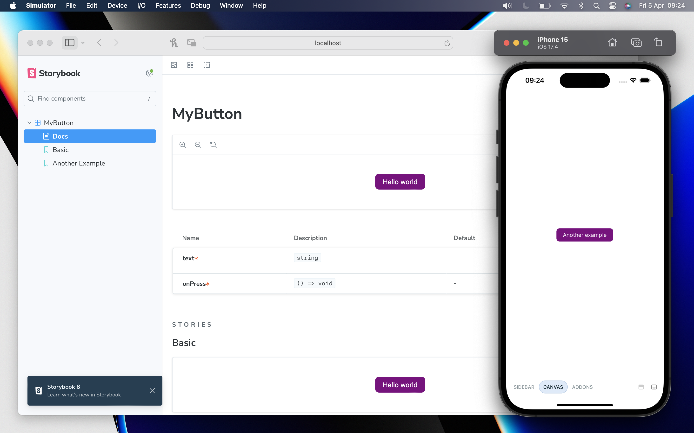

# Storybook - Web and Native
With [Storybook for React Native](https://github.com/storybookjs/react-native/?tab=readme-ov-file#storybook-for-react-native) you can design and develop individual React Native components without running your app.

<center>
  
</center>

## Getting started
```sh
yarn install
```

## Cmd
- `yarn ios` runs app on ios simulator
- `yarn web` runs app on browser 
- `yarn storybook:web` runs **storybook** on browser 
- `yarn storybook:ios` runs **storybook** on ios simulator

### How to setup on an existing project

1. Initialize a new [Expo app](https://docs.expo.dev/tutorial/create-your-first-app/#initialize-a-new-expo-app)
2. Install [web dependencies](https://docs.expo.dev/tutorial/create-your-first-app/#install-dependencies) to run expo web `expo start --web`
3. Configure Storybook for React Native ([Manual setup for existing apps](https://github.com/storybookjs/react-native/blob/next/MANUAL_SETUP.md#manual-setup))
4. Configure Storybook for Web ([copy template setup](https://github.com/dannyhw/expo-template-storybook/tree/main))